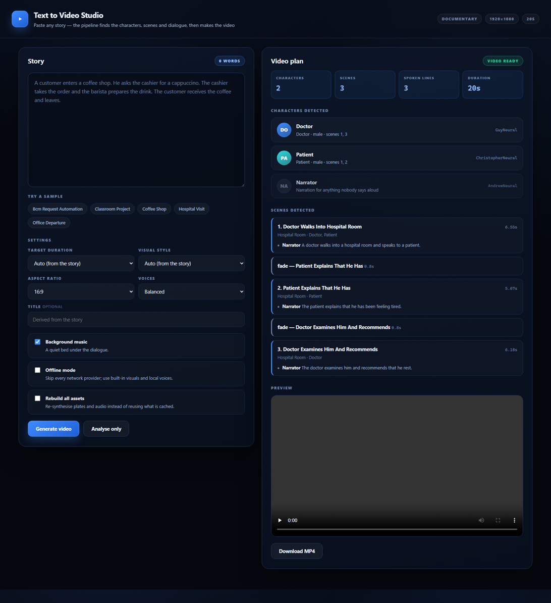
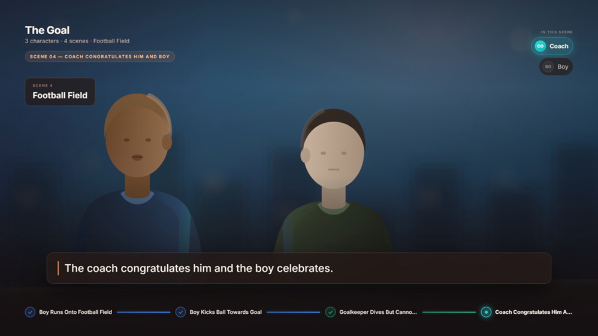
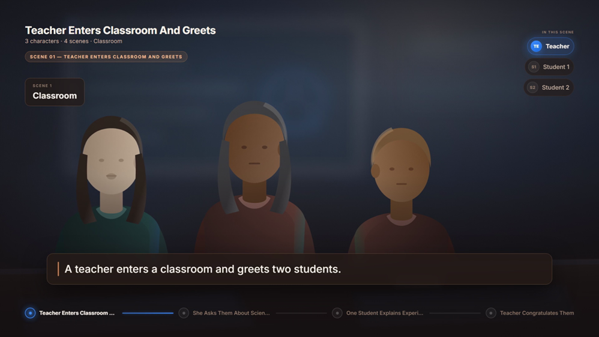
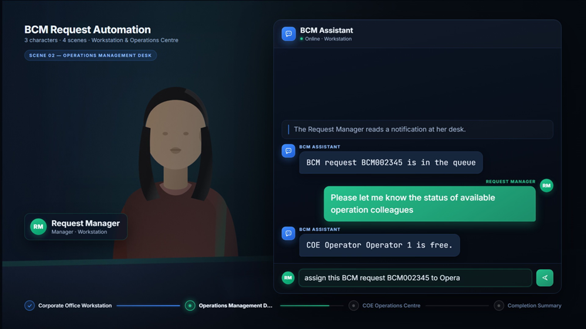

# Text to Video Studio

**Paste any story. Get a finished, narrated video.**

You give it prose or a light script. It works out who the characters are, who
speaks which line, where each scene happens and how long the whole thing should
run — then generates the visuals, synthesises the voices, renders the video and
verifies the result.

No API key required. Everything below was produced with zero network calls.



---

## What it does

```
STORY TEXT
   → analysis      characters · scenes · dialogue · locations
   → plan          identities · voices · timings · transitions · cue sheet
   → assets        scene plates · portraits · music · UI sounds · speech
   → retime        re-fit the timeline to the audio that actually exists
   → render        Remotion composition → H.264
   → verify        probe the file and check it against the plan
```

Give it four plain sentences:

> A boy runs onto the football field with his coach. The boy kicks the ball
> towards the goal. The goalkeeper dives but cannot reach it. The coach
> congratulates him and the boy celebrates.

and it derives **3 characters** (Boy, Coach, Goalkeeper — each with a distinct
voice), **4 scenes**, a **football field** location, narration for every sentence
nobody says aloud, and recognises the celebration as the closing beat:



Give it dialogue and it attributes each line to its own speaker:

> Sarah walks into the office. She says, **"We need to leave now."** John replies,
> **"Give me one minute."** They head to the street together.

- `"We need to leave now."` → **Sarah** (resolved from "She" → the previous subject)
- `"Give me one minute."` → **John**
- The exchange stays **one scene**; the move to the street becomes a **location transition**

---

## Quick start

```bash
npm install
npm run setup     # check the environment, report what will be used
npm start         # studio at http://localhost:5178
```

Paste a story, choose a duration and style, click **Generate video**.

Or from the command line:

```bash
npm run story -- stories/football-goal.txt --duration 20 --render
npm run story -- stories/bcm-request-automation.txt --style corporate --render
echo "A doctor sees a patient. The patient rests." | npm run story -- --render
```

Drop `--render` to see only what the analyser understood. Output lands in
`output/story.mp4`.

### Requirements

| Component | Required | If missing |
| --- | --- | --- |
| **Node.js 18+** | yes | — |
| **ffmpeg / ffprobe** on `PATH` | yes | the pipeline stops with an install link |
| **Python + `edge-tts`** | no | falls back to Windows SAPI voices, then to silent placeholders |
| **`OPENAI_API_KEY`** | no | falls back to the built-in analyser and procedural visuals |

Only ffmpeg is genuinely required. A machine with no API keys still produces a
complete video with speech, music and sound.

---

## What the analyser works out

| | How |
| --- | --- |
| **Characters** | role nouns ("the cashier"), proper names, and multi-word titles ("Request Manager"). Aliases merge — "the operator" and "COE Operator 1" are one person. |
| **Groups** | "two students" becomes Student 1 and Student 2; "one student" and "the other" then refer to each. |
| **Gender** | stated words, then pronouns — a sentence-initial pronoun refers to the previous sentence's subject, a mid-sentence one to the nearest preceding mention. |
| **Non-human participants** | a chatbot or system that actually responds becomes a `system` character with its own voice. One merely mentioned does not join the cast. |
| **Scenes** | explicit headings win; otherwise a location change, an arrival, or a discourse marker ("Then", "Later", "Meanwhile"). A conversation in one place stays one scene. |
| **Dialogue** | each quoted span is attributed from the narrative immediately before it, so `A types: "…" B replies: "…"` gives two speakers, not one. |
| **Typed input** | "types", "enters", "submits" mark a line as typed into an interface rather than spoken aloud. |
| **Locations** | prepositional phrases and arrival verbs, mapped to one of eight backdrop families. |
| **Finale** | completion language in the last scene ("successfully", "congratulates", "celebrates") marks the closing beat. |

**Nothing is invented.** A test asserts that every word on screen appears
verbatim in the story you supplied, and the verifier re-checks it against the
rendered plan.

---

## Options

| Option | Values | Notes |
| --- | --- | --- |
| **Duration** | auto, or 15 / 30 / 45 / 60 / 90s | Fitted by adjusting speech rate and pacing. If the story genuinely has more speech than the target allows, the plan says so instead of truncating. |
| **Style** | `corporate` · `cinematic` · `documentary` · `minimal` | Inferred from the story when unset. Each selects a palette *and* a presentation. |
| **Aspect** | 16:9 · 9:16 · 1:1 · 4:5 | |
| **Voices** | balanced · prefer male · prefer female | Only affects characters whose gender the story never states. |

### Two presentations

**Narrative** — a scene plate with the cast in the location, dialogue as speech
cards attributed to a character, narration as a lower third:



**Interface** — the same plan delivered through an application panel: typed
commands composed in the input bar and committed to a transcript, system
responses in monospace. Suits software, support and workflow stories:



Both read the same plan; only the presentation differs.

---

## Character consistency

A character's colour, initials, voice, skin, hair, build and clothing are all
derived deterministically from their identity key. Consistency is therefore
structural rather than best-effort: the same person looks and sounds identical in
scene 1 and scene 7, across re-runs, and no matter how many other characters
exist. A test asserts it.

Visuals come from a provider chain:

1. **OpenAI image generation**, when a key with credit is configured.
2. **Deterministic vector plates** — procedural backdrops for eight location
   families with the cast composited into them, drawn from those same identity
   attributes. No network, no key.

Every video and screenshot in this repository was produced by the second path.

---

## Project layout

```
engine/                     the reusable engine — knows nothing about any story
├── analysis/               text → characters, scenes, dialogue
│   ├── lexicon.mjs         role nouns, speech verbs, locations, styles
│   ├── text.mjs            segmentation, quotes, locations, timing estimates
│   ├── heuristic.mjs       the deterministic analyser (always available)
│   └── llm.mjs             optional model-backed analyser, same output shape
├── plan/                   analysis → a frame-accurate render plan
│   ├── compile.mjs         identities, timings, transitions, cue sheet
│   ├── retime.mjs          re-fit the timeline to the measured audio
│   └── store.mjs           load / save / validate, timeline helpers
├── cast/                   identity.mjs (palettes, voices) · figures.mjs
├── world/                  backdrops.mjs (8 families) · scene-plate.mjs
├── audio/                  synth.mjs · sfx.mjs · tts.mjs
├── assets/                 fonts.mjs · plates-build.mjs
├── render/                 render.mjs · verify.mjs
└── pipeline.mjs            the stages, wired together

stories/                    sample inputs
src/                        Remotion composition, driven entirely by the plan
├── plan.ts                 the plan and its types
├── scenes/                 NarrativeScene · InterfaceScene · TransitionSegment
└── components/             Stage · ChatMessages · primitives
server/                     Express API + studio UI
tests/                      analysis · plan · assets · output
docs/ARCHITECTURE.md        how the pieces fit together
```

The **engine is importable on its own**:

```js
import { generateVideo } from './engine/pipeline.mjs';

const { plan, verification } = await generateVideo(
  'A doctor walks into a hospital room and speaks to a patient.',
  { targetSeconds: 20, styleId: 'documentary' },
);
```

---

## Commands

| Command | What it does |
| --- | --- |
| `npm run setup` | Environment preflight; reports every provider and fallback |
| `npm start` | The studio on port 5178 |
| `npm run story -- <file>` | Analyse a story and write a plan |
| `npm run story -- <file> -r` | …and build assets, render and verify |
| `npm run assets` | Build assets for the current plan (`-- --force`, `-- --offline`) |
| `npm run render` | Render the current plan |
| `npm run verify` | Probe and check the rendered file |
| `npm test` | 98 tests across analysis, plan, assets and output |
| `npm run studio` | Remotion Studio, for inspecting scenes interactively |

`npm run story` flags: `--duration`, `--style`, `--title`, `--aspect`, `--voice`,
`--no-music`, `--render`, `--force`, `--offline`.

---

## How the timing works

1. The compiler estimates each line's spoken length — measured against the
   *spoken* form, since `BCM002345` is read as ten characters, not one word.
2. If a duration was requested, it solves for a speech rate and pacing scale that
   fit, within sane limits.
3. Voices are synthesised.
4. **Retiming** replaces every estimate with the measured audio length and
   re-lays the timeline, then pads back to the target if the real speech came in
   short.

That last step is why audio and picture are exactly aligned rather than
approximately aligned, and why no line is ever cut off by its own scene ending.

---

## Verification

`npm run verify` is the acceptance gate. Everything it checks is derived from the
plan — it hard-codes no scene count, duration or line of dialogue:

- container, resolution, frame rate, duration and frame count against the timeline
- an audio track that carries real signal and does not clip
- every planned scene present, with a transition between each pair
- every character holding one identity, with a distinct voice per speaker
- every planned line synthesised, fitting its scene, attributed to a known voice
- **every word on screen present verbatim in the source story**
- one sampled frame from every scene and transition, confirmed non-blank

---

## Sample stories

| File | Derived |
| --- | --- |
| `football-goal.txt` | 3 characters, 4 scenes, football field · 20s |
| `coffee-shop.txt` | 3 characters, 4 scenes, café · 30s |
| `classroom-project.txt` | Teacher + Student 1/2, 4 scenes, classroom · 30s |
| `hospital-visit.txt` | Doctor + Patient, 3 scenes, hospital room · 20s |
| `office-departure.txt` | Sarah + John with quoted dialogue, office → street |
| `bcm-request-automation.txt` | 4 characters incl. a system, 4 scenes, corporate style · 60s |

The last one is an enterprise workflow script — a deliberately awkward input with
alphanumeric identifiers, a non-human participant and typed commands. It runs
through the same general pipeline as everything else; nothing about it is
special-cased.

---

## Configuration

Copy `.env.example` to `.env`. Every value is optional.

```ini
OPENAI_API_KEY=      # model-backed analysis and photoreal plates
OPENAI_BASE_URL=     # alternate OpenAI-compatible endpoint
STORY_MODEL=         # model for story analysis (default gpt-4o-mini)
PYTHON_BIN=python    # interpreter used for edge-tts
PORT=5178            # studio port
```

No secret is ever written into the repository or a plan.

---

## Troubleshooting

| Symptom | Cause and fix |
| --- | --- |
| `ffmpeg is not available on PATH` | Install ffmpeg and reopen the terminal. `npm run setup` confirms it. |
| `No render plan has been generated yet` | Submit a story first, or `npm run story -- <file>`. |
| `N generated asset(s) are missing` | `npm run assets`. The message lists each missing file. |
| Voices are silent | No TTS provider was reachable. `npm run setup` shows which are available; the render still succeeds with silent placeholders. |
| The analyser missed a character | Name them explicitly, or use a scene heading. `npm run story -- <file>` prints exactly what was understood without rendering. |
| Runtime does not match the target | The story has more or less speech than the target allows. The plan and the verifier both say which. |
| `port 5178 is already in use` | `PORT=5179 npm start` |

Every pipeline error carries a stage, a message and a remediation hint, and the
studio displays all three.

---

## License

MIT — see [LICENSE](LICENSE).

---

## Built with

[Remotion](https://remotion.dev) · [Express](https://expressjs.com) ·
[edge-tts](https://github.com/rany2/edge-tts) · [FFmpeg](https://ffmpeg.org) ·
Node.js test runner

Music, sound effects, character figures and location backdrops are all
synthesised procedurally — no stock assets, no licensing questions.
